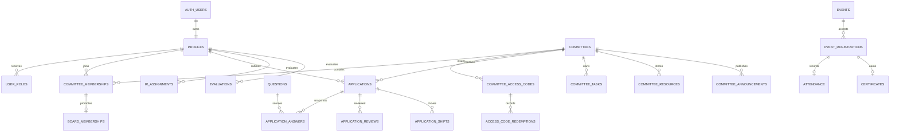

# ALIENS SPACE — Canonical Architecture

## 1. Architecture summary

ALIENS SPACE is split into a public PR surface and a private team operating system. The browser uses Supabase Auth for identity persistence through secure cookie-based sessions, Supabase PostgREST/RPC for data access, and Supabase Storage for object references. The client domain layer is intentionally separated from presentational pages. Sensitive writes use database functions with `auth.uid()` and restrictive RLS rather than client-supplied actor or role data.

The old website is a reference for page inventory, cosmic/neon visual language, bilingual UX ideas, recruitment entry points, events, gallery, member directory, profile, and a restricted command center. It is not an application dependency and is not a source of operational data.

## 2. Canonical schema

| Domain | Tables | Invariants |
|---|---|---|
| Identity | `auth.users`, `profiles`, `user_roles`, `permissions`, `role_permissions` | One profile per Auth user; roles are relational, not profile text |
| Committees | `committees`, `committee_memberships`, `board_memberships` | Positions are `member`, `head`, `sub_head`; active head/sub-head creates board membership |
| Activation | `committee_access_codes`, `access_code_redemptions` | Code is hashed; expiry, max uses, single-use, duplicate, and row-lock checks are server/database enforced |
| Public content | `site_settings`, `site_content`, `gallery_albums`, `gallery_media`, `projects`, `achievements`, `partners` | Public reads require explicit published/public state |
| Recruitment | `questions`, `applications`, `application_answers`, `application_reviews`, `application_shifts` | Enabled prompts are snapshotted at submission; history survives prompt edits/deletion |
| IR and evaluations | `ir_evaluator_eligibility`, `ir_assignments`, `evaluations` | Eligibility is separate from membership; one active evaluator per member; capacity is 30 |
| Events | `events`, `event_registrations`, `attendance` | Registration and attendance are separate; duplicate/close/capacity protections are database-backed |
| Certificates | `certificates`, `certificate_claims` | One certificate per registration; recipient is copied from original registration; code is unique and immutable |
| Workspace | `committee_tasks`, `committee_resources`, `committee_announcements` | Committee lead/member scope is derived from active membership |
| Communications | `notifications` | Provider state is queued/sent/failed and confirmation is required before sent |
| Governance | `audit_logs` | Actor is `auth.uid()`; secrets and raw codes never enter metadata |

## 3. Relationship map

## 4. RLS matrix

| Resource | Public/anon | Authenticated user | Committee lead | Team lead | OG |
|---|---|---|---|---|---|
| Published committees/events/media | Read published projection | Read published projection | Same | Same | Same |
| Public profiles | Read approved rows | Read approved rows + own profile | Same | Same | Same |
| Own profile | None | Read/update own row | Same | Same | Same |
| Memberships | None | Read own memberships | Read own committee scope | Team scope | Global scope |
| Access codes/redemptions | No direct table access | RPC redemption only | Admin RPC management | Authorized management | Global management |
| Questions | Enabled public questions | Enabled public questions | Own committee questions | Team/global scope | Global scope |
| Applications/answers | RPC submission only | Own submission / authorized scope | Own committee | Team scope | Global scope |
| IR assignments/evaluations | None | Own allowed visibility | Own committee scope | Team scope | Global scope |
| Event registrations | Public registration RPC | Own registration + authorized event scope | Authorized event scope | Broader scope | Global scope |
| Attendance | None | Read own status | Authorized own event scope | Broader scope | Global scope |
| Certificates | Public verification RPC only | Own certificate + authorized scope | Authorized scope | Broader scope | Global scope |
| Workspace tasks/resources/announcements | None | Active committee membership scope | Own committee management | Team scope | Global scope |
| Audit logs | None | None by default | Authorized scoped read | Team scope | Global read |

The migration intentionally revokes direct access to access-code tables, audit logs, evaluations, and application answer rows from untrusted clients. In production, any additional management policies must be added only with explicit scope predicates; broad `USING(true)` and `WITH CHECK(true)` policies are prohibited.

## 5. RPC list

| RPC | Purpose | Security boundary |
|---|---|---|
| `redeem_committee_access_code(text)` | Atomic activation and membership creation | Uses `auth.uid()`, row lock, hashed code match, usage checks, unique redemption, audit |
| `submit_public_application(uuid,text,text,text,uuid,jsonb)` | Guest/user recruitment submission | User id must equal `auth.uid()`; committee and question availability validated; snapshots prompts |
| `register_event_authenticated(uuid)` | Authenticated event registration | Published/open/capacity/duplicate checks in one transaction |
| `mark_event_attendance(uuid,attendance_status)` | Attendance update | Actor authorization derives from role and event scope |
| `issue_certificate(uuid)` | Server-side certificate issue | Requires authorized leadership, attended state, enabled certificate, original registration identity |
| `verify_certificate_public(text)` | Minimal public verification | Returns only valid, recipient, event, date, signatory |
| `shift_application(uuid,uuid,text)` | Planned application committee shift | Must verify actor scope, write history, update assignment, enqueue notification |
| `assign_ir_member(uuid,uuid)` | Planned evaluator assignment | Explicit eligibility, one active assignment, remaining capacity, audit |

The first migration includes the implemented RPCs for access-code redemption, public applications, authenticated registration, attendance, certificate issue, and public verification. Shift and evaluator-assignment RPCs are listed as the next backend milestone and must be added before those dashboard actions are represented as complete.

## 6. Storage structure

| Bucket | Access | Key pattern | Database reference |
|---|---|---|---|
| `profile-avatars` | Private signed URLs | `{user_id}/{uuid}-{safe_filename}` | `profiles.avatar_object_key` |
| `gallery-media` | Public only for published media | `{album_id}/{uuid}-{safe_filename}` | `gallery_media.object_key` |
| `committee-resources` | Private committee-scoped signed URLs | `{committee_id}/{uuid}-{safe_filename}` | `committee_resources.object_key` |
| `certificate-files` | Private owner/authorized/claim access | `{certificate_id}/{uuid}.pdf` | `certificates.file_object_key` |

The browser never stores file bytes or base64. Upload flows create an object, persist only its key and metadata, then refetch the authoritative row.

## 7. Permission and capability matrices

| Role/state | Public content | Own profile | Own committee workspace | Recruitment review | IR assignment | Attendance/certificates | Global operations |
|---|---:|---:|---:|---:|---:|---:|---:|
| Guest | Read published | No | No | Submit | No | Register only | No |
| Registered user | Read published | Read/update | No until membership | Submit and own status | No | Own registration/certificate | No |
| Team member | Read published | Read/update | Assigned work | Submit/own scope | No unless eligible | Read own scope | No |
| Committee head | Read published | Read/update | Manage own committee | Own committee review | No by default | Own authorized events | No |
| Committee sub-head | Read published | Read/update | Manage own committee | Own committee review | No by default | Own authorized events | No |
| IR evaluator | Read published | Read/update | Own membership | Assigned review | Read own assignment | Authorized evaluation scope | No |
| IR head/sub-head | Read published | Read/update | IR workspace | IR recruitment scope | Assign/unassign/reassign | Authorized scope | No |
| Team head/sub-head | Read published | Read/update | Team scope | Team scope | Team scope | Broader event scope | Limited |
| OG | Read published | Read/update | Global | Global | Global | Global | Global |

Dashboard capabilities follow this matrix: applications support search/filter/detail/review/decision/conflict/delete/shift/export; questions support add/edit/delete/reorder/enable/disable/preview; IR supports assignment and capacity; events support CRUD/publish/registrations; attendance supports attended/not attended; certificates support issue/view/verify/download; workspaces support tasks/resources/announcements/activity; analytics supports only permission-scoped data exports.

## 8. Legacy content-extraction plan

The legacy reference currently identifies the content families and page sections but does not authorize copying its runtime store. The migration path is: inventory useful copy and approved imagery; map each item to `site_content`, `committees`, `events`, `gallery_albums`, `gallery_media`, `projects`, `achievements`, `partners`, or question tables; review/clean the copy; import through a controlled Supabase migration or admin workflow; verify public projections; then remove any temporary import artifacts. Legacy `seedData.ts` is source material for review only and must not be imported automatically.

## 9. Unverified items

The SQL migration is authored and stored in the repository, but applying it to the target Supabase project and exercising every policy requires the user's Supabase SQL editor/project connection. Email confirmation and password-reset redirect settings require Supabase Auth configuration. WhatsApp delivery requires a provider URL/token and an Edge Function or server-side worker; the data model and notification state model are prepared, but provider delivery is not claimed until configured and confirmed. Production RLS penetration tests, real guest certificate claims, and complete role fixtures are also unverified until executed against non-demo data.
